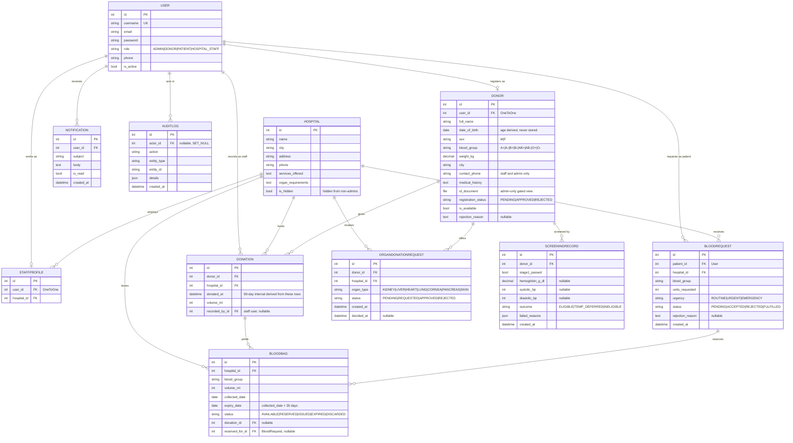

# CBODS — Entity Relationship Diagram

Eleven models across eight Django apps. Rendered by GitHub directly from the
Mermaid source below.

## Design notes

**Nothing computed is stored.** Stock levels are counted from `BLOODBAG` rows
with `status = AVAILABLE`, grouped by hospital and blood group. A donor's next
eligible date is derived from their most recent `DONATION` row, and their age
from `date_of_birth`. No counter or cached date exists to drift out of step
with reality.

**`BLOODBAG.reserved_for`** ties a reserved bag to the request that reserved it,
so fulfilling one request can never consume another request's reservation. The
reservation and issue both run inside `transaction.atomic()` with
`select_for_update()`, re-checking status under the lock.

**`AUDITLOG` uses a loose reference** (`entity_type` + `entity_id`) rather than
foreign keys, so an audit entry survives the deletion of whatever it describes —
an audit trail that disappears with its subject is not an audit trail.

**Privacy boundaries** live in views and querysets, not in the schema: patients
never see donor identities, donors never see patient details, staff are scoped
to their own hospital through `STAFFPROFILE`, and hospitals flagged `is_hidden`
are filtered out for every non-admin. `DONOR.id_document` is reachable only
through an ADMIN-gated view — `MEDIA_ROOT` has no URL route at all.

**One donor, one user.** `DONOR` and `STAFFPROFILE` are both `OneToOne` on
`USER`, so a person's role determines which profile they can hold. Patients need
no profile row — they are simply a `USER` with `role = PATIENT`.
