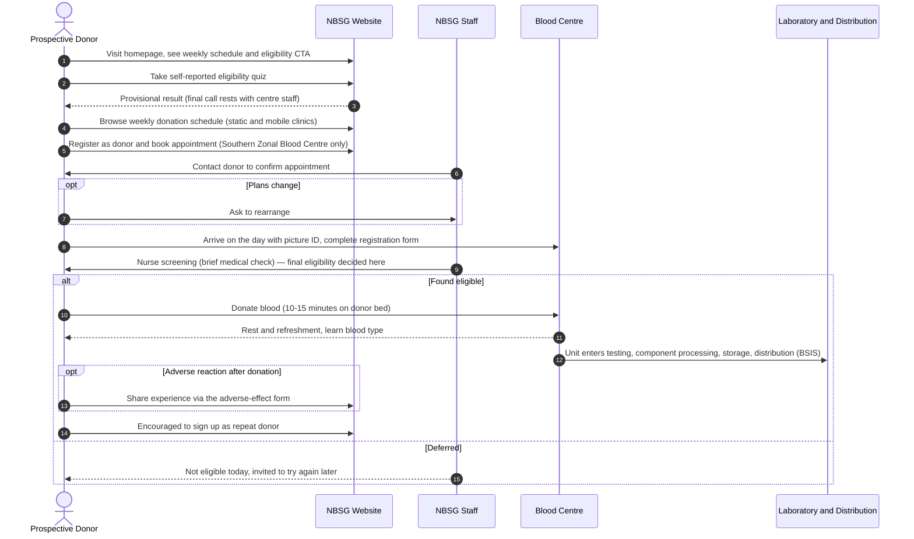
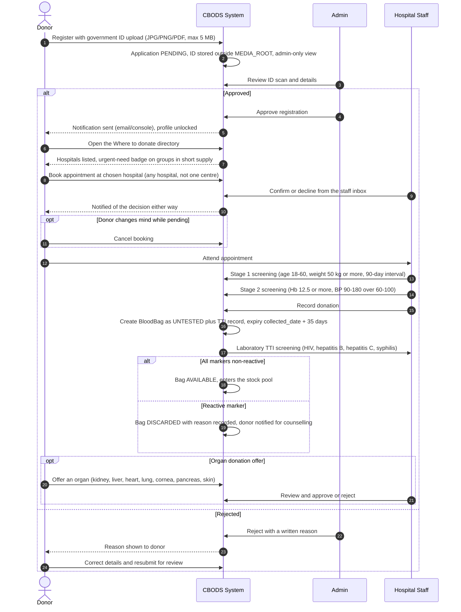
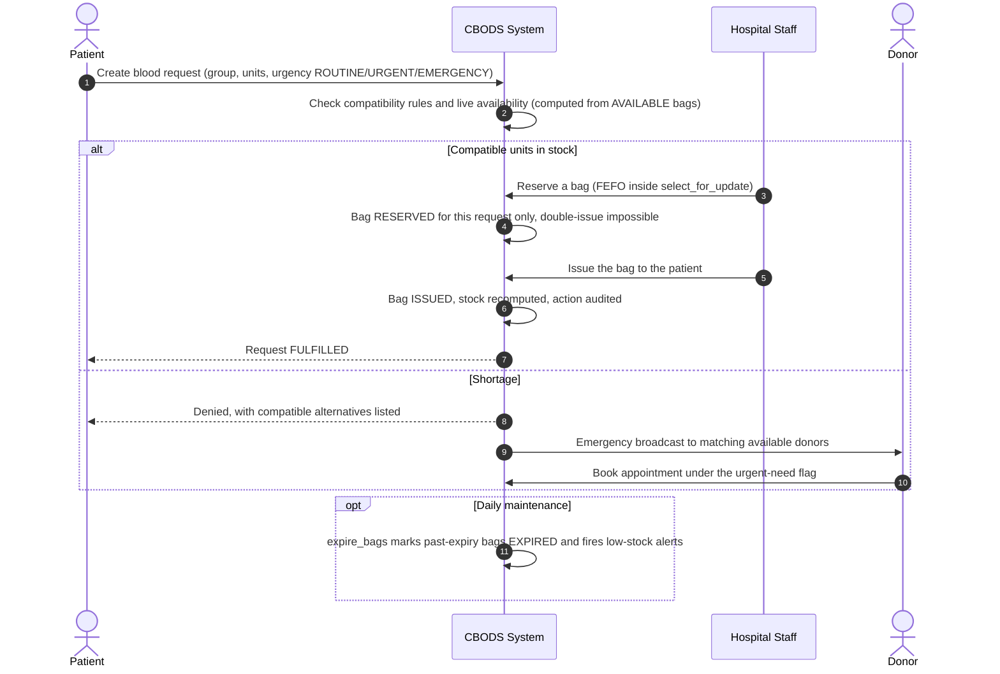

# CBODS — User Flow Comparison (NBSG vs CBODS)

Three sequence diagrams comparing how a donation actually happens under Ghana's
National Blood Service public workflow (nbs.gov.gh) and under CBODS. Rendered
by GitHub directly from the Mermaid sources below.

The key structural difference: **NBSG is broadcast-first** — the service
publishes a schedule, donors self-select, and every consequential step
(eligibility, confirmation, identification) is completed in person by staff.
**CBODS is transaction-first** — each of those steps is a recorded, audited
interaction inside the system, and CBODS adds the demand side (patient
requests matched to hospital stock) which NBSG's public flow leaves to phones
and walk-ins.

---

## 1. NBSG — donor journey (as published on nbs.gov.gh)

Reading notes:

- Steps 2–5 are **self-selected and unverified**: the quiz is honest-answer
  self-assessment, the booking is a single centre, and confirmation is a human
  callback rather than a tracked status.
- Identity is checked physically (picture ID at the desk) — there is no
  electronic ID verification before the donor arrives.
- Everything downstream of the needle (testing, processing, distribution) is
  the domain of BSIS, the blood service's internal information system — none of
  it is visible to the donor through the public site. CBODS models the first of
  these steps (TTI screening) as its laboratory gate; component processing and
  distribution remain out of scope.

---

## 2. CBODS — donor journey (registration to donation)

Reading notes:

- The 90-day interval between donations is **derived from recorded `Donation`
  rows**, not from donor memory — the same rule NBSG's quiz leaves to honesty.
- Every mandated action (approval, screening, booking, confirmation,
  cancellation, donation, bag creation) writes an `AuditLog` row.
- Booking is steered by live scarcity: hospitals short on the donor's blood
  group carry the "Book now — urgent need" button, so donors land where blood
  is scarcest. NBSG's schedule is static publication with no stock signal.

---

## 3. CBODS — patient request journey (the demand side NBSG's public flow lacks)

Reading notes:

- The NBSG public flow has **no patient-facing leg at all**: a patient's need
  travels by clinician referral and phone. In CBODS the request, the
  compatibility check, the reservation and the issue are all first-class
  recorded transactions.
- Reservation isolation (`BloodBag.reserved_for`) plus row locking means two
  staff can never fulfil two requests with the same bag — an integrity
  guarantee a paper or broadcast workflow cannot make.

---

## Step-by-step mapping

| NBSG step | CBODS equivalent | What changed |
|---|---|---|
| Self-reported eligibility quiz | Staff-recorded stage-1 screening | Honesty replaced by recorded data |
| Static weekly schedule publication | Live hospital directory ranked by shortage | Donors steered to scarcity |
| Book at one centre, confirmed by callback | Book at any hospital, confirmed in-app with tracked status | Human loop replaced by audited workflow |
| Picture ID checked at the desk | Government ID uploaded at registration, admin-gated | Verification happens before arrival |
| Nurse screening at the centre | Stage-2 ScreeningRecord (Hb, BP) with failed reasons | Outcome persisted, deferral history queryable |
| In-person lab TTI testing (BSIS domain) | TTITestRecord per donation, UNTESTED to AVAILABLE gate | Safety gate modelled; confirmatory testing out of scope |
| Adverse-effect sharing form | Not modelled | Known gap |
| Learn blood type after donation | Blood group on profile from registration | Known earlier, editable by donor |
| Offline testing/processing/distribution (BSIS) | Out of scope — one whole-blood bag per donation | Deliberate MVP boundary |
